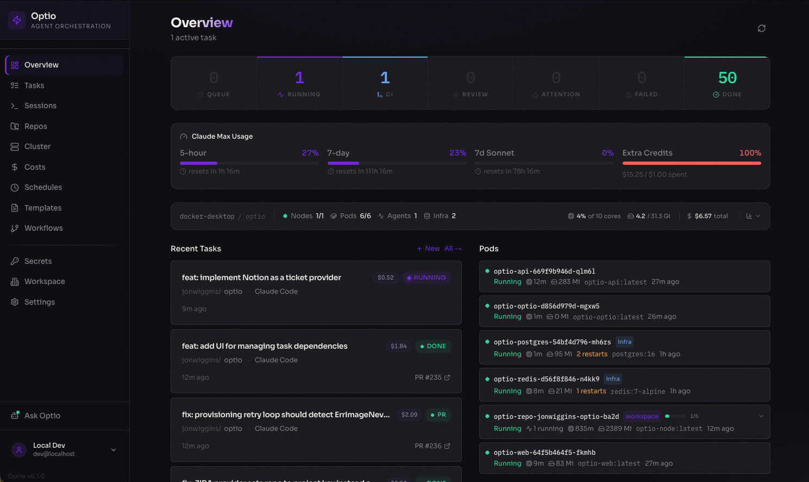
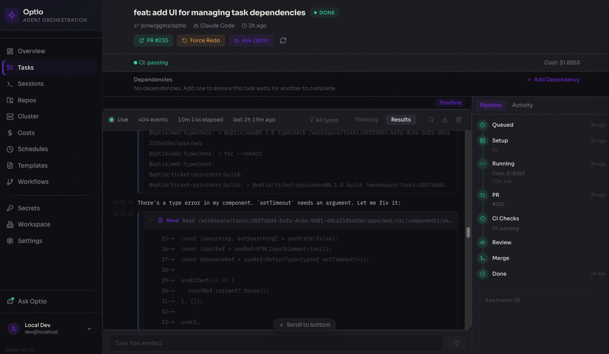

# Optio

**Workflow orchestration for AI coding agents, from task to merged PR.**

[](https://github.com/jonwiggins/optio/actions/workflows/ci.yml)
[](./LICENSE)

Optio turns coding tasks into merged pull requests — without human babysitting. Submit a task (manually, from a GitHub Issue, or from Linear), and Optio handles the rest: provisions an isolated environment, runs an AI agent, opens a PR, monitors CI, triggers code review, auto-fixes failures, and merges when everything passes.

The feedback loop is what makes it different. When CI fails, the agent is automatically resumed with the failure context. When a reviewer requests changes, the agent picks up the review comments and pushes a fix. When everything passes, the PR is squash-merged and the issue is closed. You describe the work; Optio drives it to completion.

<p align="center">
  
</p>
<p align="center"><em>Dashboard — real-time overview of running agents, pod status, costs, and recent activity</em></p>

<p align="center">
  
</p>
<p align="center"><em>Task detail — live-streamed agent output with pipeline progress, PR tracking, and cost breakdown</em></p>

## How It Works

```
You create a task          Optio runs the agent           Optio closes the loop
─────────────────          ──────────────────────         ──────────────────────

  GitHub Issue              Provision repo pod             CI fails?
  Manual task       ──→     Create git worktree    ──→       → Resume agent with failure context
  Linear ticket             Run Claude Code / Codex        Review requests changes?
                            Open a PR                        → Resume agent with feedback
                                                           CI passes + approved?
                                                             → Squash-merge + close issue
```

1. **Intake** — tasks come from the web UI, GitHub Issues (one-click assign), or Linear tickets
2. **Provisioning** — Optio finds or creates a Kubernetes pod for the repo, creates a git worktree for isolation
3. **Execution** — the AI agent (Claude Code or OpenAI Codex) runs with your configured prompt, model, and settings
4. **PR lifecycle** — Optio polls the PR every 30s for CI status, review state, and merge readiness
5. **Feedback loop** — CI failures, merge conflicts, and review feedback automatically resume the agent with context
6. **Completion** — PR is squash-merged, linked issues are closed, costs are recorded

## Key Features

- **Autonomous feedback loop** — auto-resumes the agent on CI failures, merge conflicts, and review feedback; auto-merges when everything passes
- **Pod-per-repo architecture** — one long-lived Kubernetes pod per repo with git worktree isolation, multi-pod scaling, and idle cleanup
- **Code review agent** — automatically launches a review agent as a subtask, with a separate prompt and model
- **Per-repo configuration** — model, prompt template, container image, concurrency limits, and setup commands, all tunable per repository
- **GitHub Issues and Linear intake** — assign issues to Optio from the UI or via ticket sync
- **Real-time dashboard** — live log streaming, pipeline progress, cost analytics, and cluster health

## Architecture

```
┌──────────────┐     ┌────────────────────┐     ┌──────────────────────────┐
│   Web UI     │────→│    API Server      │────→│      Kubernetes          │
│   Next.js    │     │    Fastify         │     │                          │
│   :3100      │     │                    │     │  ┌── Repo Pod A ──────┐  │
│              │←ws──│  Workers:          │     │  │ clone + sleep      │  │
│  Dashboard   │     │  ├─ Task Queue     │     │  │ ├─ worktree 1  ⚡  │  │
│  Tasks       │     │  ├─ PR Watcher     │     │  │ ├─ worktree 2  ⚡  │  │
│  Repos       │     │  ├─ Health Mon     │     │  │ └─ worktree N  ⚡  │  │
│  Cluster     │     │  └─ Ticket Sync    │     │  └────────────────────┘  │
│  Costs       │     │                    │     │  ┌── Repo Pod B ──────┐  │
│  Issues      │     │  Services:         │     │  │ clone + sleep      │  │
│              │     │  ├─ Repo Pool      │     │  │ └─ worktree 1  ⚡  │  │
│              │     │  ├─ Review Agent   │     │  └────────────────────┘  │
│              │     │  └─ Auth/Secrets   │     │                          │
└──────────────┘     └─────────┬──────────┘     └──────────────────────────┘
                               │                  ⚡ = Claude Code / Codex
                        ┌──────┴──────┐
                        │  Postgres   │  Tasks, logs, events, secrets, repos
                        │  Redis      │  Job queue, pub/sub, live streaming
                        └─────────────┘
```

### Task lifecycle

```
  ┌─────────────────────────────────────────────────┐
  │                    INTAKE                        │
  │                                                  │
  │   GitHub Issue ───→ ┌──────────┐                 │
  │   Manual Task ───→  │  QUEUED  │                 │
  │   Ticket Sync ───→  └────┬─────┘                 │
  └───────────────────────────┼──────────────────────┘
                              │
  ┌───────────────────────────┼──────────────────────┐
  │                 EXECUTION ▼                       │
  │                                                   │
  │   ┌──────────────┐    ┌─────────────────┐         │
  │   │ PROVISIONING │───→│     RUNNING     │         │
  │   │ get/create   │    │  agent writes   │         │
  │   │ repo pod     │    │  code in        │         │
  │   └──────────────┘    │  worktree       │         │
  │                        └───────┬─────────┘         │
  └────────────────────────────────┼──────────────────┘
                                   │
                 ┌─────────────┐   │   ┌─────────────────┐
                 │   FAILED    │←──┴──→│   PR OPENED     │
                 │             │       │                  │
                 │ (auto-retry │       │  PR watcher      │
                 │  if stale)  │       │  polls every 30s │
                 └─────────────┘       └────────┬─────────┘
                                                │
  ┌─────────────────────────────────────────────┼────────┐
  │                 FEEDBACK LOOP                │        │
  │                                              │        │
  │   CI fails?  ────────→  Resume agent  ←──────┤        │
  │                          to fix build         │        │
  │                                              │        │
  │   Merge conflicts? ──→  Resume agent  ←──────┤        │
  │                          to rebase            │        │
  │                                              │        │
  │   Review requests ───→  Resume agent  ←──────┤        │
  │   changes?               with feedback        │        │
  │                                              │        │
  │   CI passes + ───────→  Auto-merge    ───────┘        │
  │   review done?           & close issue                │
  │                                                       │
  │                          ┌─────────────┐              │
  │                          │  COMPLETED  │              │
  │                          │  PR merged  │              │
  │                          │  Issue closed│              │
  │                          └─────────────┘              │
  └───────────────────────────────────────────────────────┘
```

## Quick Start

### Prerequisites

- **Docker Desktop** with Kubernetes enabled (Settings → Kubernetes → Enable)
- **Node.js 22+** and **pnpm 10+**

### Setup

```bash
# Clone and install
git clone https://github.com/jonwiggins/optio.git && cd optio
pnpm install

# Bootstrap infrastructure (Postgres + Redis in K8s, migrations, .env)
./scripts/setup-local.sh

# Build the agent image
docker build -t optio-agent:latest -f Dockerfile.agent .

# Start dev servers
pnpm dev
# API → http://localhost:4000
# Web → http://localhost:3100
```

The setup wizard walks you through configuring GitHub access, agent credentials (API key or Max Subscription), and adding your first repository.

## Project Structure

```
apps/
  api/          Fastify API server, BullMQ workers, WebSocket endpoints,
                review service, subtask system, OAuth providers
  web/          Next.js dashboard with real-time streaming, cost analytics

packages/
  shared/             Types, task state machine, prompt templates, error classifier
  container-runtime/  Kubernetes pod lifecycle, exec, log streaming
  agent-adapters/     Claude Code + Codex prompt/auth adapters
  ticket-providers/   GitHub Issues, Linear

images/               Container Dockerfiles: base, node, python, go, rust, full
helm/optio/           Helm chart for production Kubernetes deployment
scripts/              Setup, init, and entrypoint scripts
```

## Production Deployment

Optio ships with a Helm chart for production Kubernetes clusters:

```bash
helm install optio helm/optio \
  --set encryption.key=$(openssl rand -hex 32) \
  --set postgresql.enabled=false \
  --set externalDatabase.url="postgres://..." \
  --set redis.enabled=false \
  --set externalRedis.url="redis://..." \
  --set ingress.enabled=true \
  --set ingress.hosts[0].host=optio.example.com
```

See the [Helm chart values](helm/optio/values.yaml) for full configuration options including OAuth providers, resource limits, and agent image settings.

## Tech Stack

| Layer    | Technology                                                       |
| -------- | ---------------------------------------------------------------- |
| Monorepo | Turborepo + pnpm                                                 |
| API      | Fastify 5, Drizzle ORM, BullMQ                                   |
| Web      | Next.js 15, Tailwind CSS 4, Zustand                              |
| Database | PostgreSQL 16                                                    |
| Queue    | Redis 7 + BullMQ                                                 |
| Runtime  | Kubernetes (Docker Desktop for local dev)                        |
| Deploy   | Helm chart                                                       |
| Auth     | Multi-provider OAuth (GitHub, Google, GitLab)                    |
| CI       | GitHub Actions (format, typecheck, test, build-web, build-image) |
| Agents   | Claude Code, OpenAI Codex                                        |

## Contributing

See [CONTRIBUTING.md](./CONTRIBUTING.md) for development setup, workflow, and conventions.

## License

[MIT](./LICENSE)
